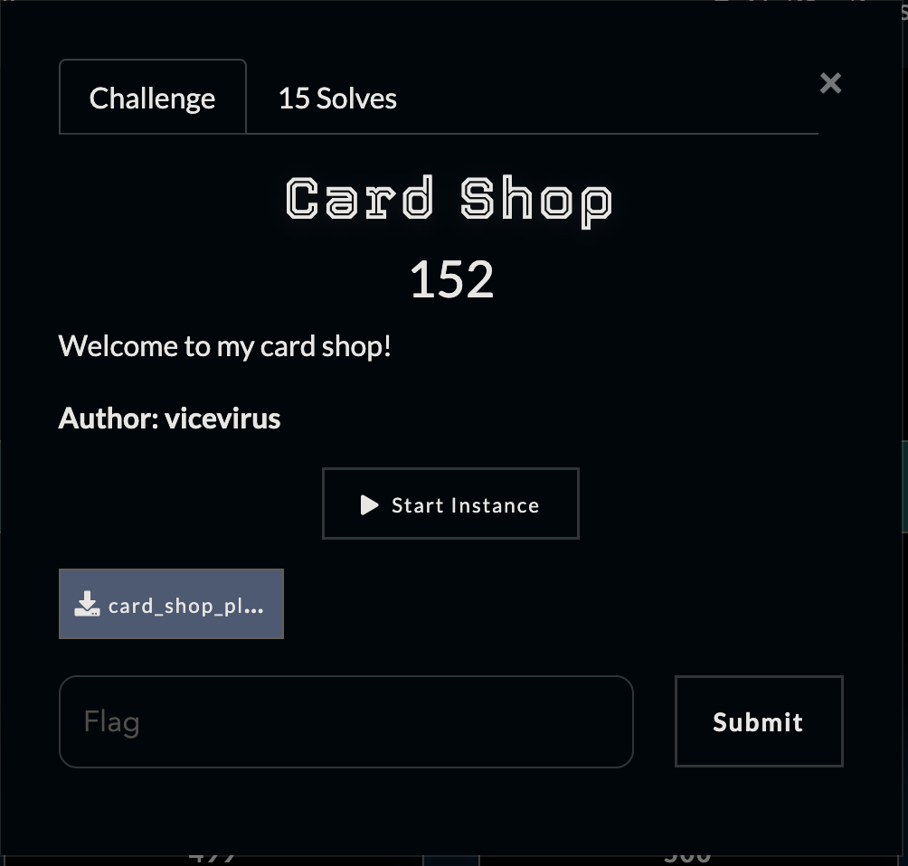

# [Crypto]
## Quantum-Web-Token


### TLDR:
- Implements BB84 quantum key distribution protocol
- Uses Qiskit for quantum circuit simulation
- Uses JWT (JSON Web Tokens) for communication
- Involves 32 qubits per round
- Goal: We need to guess Bob's measured bits (r_bits) correctly to get the flag

The vulnerability was indeed that `s_bits` (Alice's secret bits) were not regenerated for each new connection or session, allowing us to collect them over multiple rounds. Once all `s_bits`were known, we could use the xor values from the last round's qwt tokens to determine Bob's measured bits `r_bits` and submit the correct guess.

  

### Solve Script

```python
#!/usr/bin/env python3
# Solution for quantum-web-token CTF challenge

from pwn import * # Using pwntools for connection convenience
import base64
import json
import time

# JWT decoding function
def decode_jwt_payload_segment(payload_b64_str: str) -> dict:
    """
    Decodes the payload segment of a JWT token.
    The input is the base64url encoded payload string (middle part of JWT).
    """
    # Add padding if necessary for base64url decoding
    padded_payload_b64_str = payload_b64_str + '=' * (-len(payload_b64_str) % 4)
    payload_json_bytes = base64.urlsafe_b64decode(padded_payload_b64_str)
    return json.loads(payload_json_bytes.decode('utf-8'))

def solve(max_retries=5, initial_timeout=15, per_line_timeout=10, recv_timeout=10): # Increased timeouts
    for attempt in range(max_retries):
        log.info(f"Starting attempt {attempt + 1}/{max_retries}")
        conn = None  # Initialize conn to None
        try:
            # Set up pwntools context for quieter output or debugging
            # context.log_level = 'debug' # Uncomment for verbose pwntools output
            context.log_level = 'info'

            # conn = remote("localhost", 5001) # For local testing
            conn = remote("116.203.176.73", 5001, timeout=initial_timeout)
            log.info("Connected to server.")

            # Receive welcome message
            welcome_msg = conn.recvuntil(b"Sending qubits through quantum channel:\n", timeout=recv_timeout)
            log.info(f"Welcome message received: {welcome_msg.decode().strip()}")
            
            time.sleep(0.5) # Add a small delay after welcome, before server sends JWTs

            n_qubits = 32
            s_bits_master = [None] * n_qubits # Stores the known s_bits from Alice
            num_s_bits_known = 0
            current_round_xors = [None] * n_qubits # Stores XOR values for the current round (needs to be accessible after loop)


            round_num = 0
            # Loop until all of Alice's s_bits are known
            while num_s_bits_known < n_qubits:
                round_num += 1
                log.info(f"Starting Round {round_num}. Known s_bits: {num_s_bits_known}/{n_qubits}")
                
                # 1. Receive n_qubits qwt JWTs (individual qubit info)
                for i in range(n_qubits):
                    try:
                        jwt_line_bytes = conn.recvline(timeout=per_line_timeout) 
                        if not jwt_line_bytes:
                            log.error(f"Connection closed prematurely while reading qwt JWT {i} in round {round_num}.")
                            raise EOFError("Connection closed by server")
                        jwt_line = jwt_line_bytes.strip().decode()
                        
                        if jwt_line.count('.') != 2:
                            log.error(f"Received malformed JWT in round {round_num}, JWT {i}: {jwt_line}")
                            raise ValueError("Malformed JWT received")

                        payload_b64_str = jwt_line.split('.')[1]
                        payload = decode_jwt_payload_segment(payload_b64_str)
                        current_round_xors[i] = payload['xor']
                    except Exception as e:
                        log.error(f"Error processing qwt JWT {i} in round {round_num}: {e}")
                        problematic_line = jwt_line_bytes if 'jwt_line_bytes' in locals() and jwt_line_bytes is not None else b'N/A'
                        log.error(f"Problematic JWT line (if any): {problematic_line.decode(errors='ignore')}")
                        raise 
                log.info(f"Round {round_num}: Received all {n_qubits} qwt JWTs.")

                # 2. Receive p_key JWT (sifted key info)
                try:
                    pkey_jwt_line_bytes = conn.recvline(timeout=per_line_timeout)
                    if not pkey_jwt_line_bytes:
                        log.error(f"Connection closed prematurely while reading pkey JWT in round {round_num}.")
                        raise EOFError("Connection closed by server")
                    pkey_jwt_line = pkey_jwt_line_bytes.strip().decode()

                    if pkey_jwt_line.count('.') != 2:
                        log.error(f"Received malformed pkey JWT in round {round_num}: {pkey_jwt_line}")
                        raise ValueError("Malformed pkey JWT received")
                    
                    pkey_payload_b64_str = pkey_jwt_line.split('.')[1]
                    pkey_payload = decode_jwt_payload_segment(pkey_payload_b64_str)
                except Exception as e:
                    log.error(f"Error processing pkey JWT in round {round_num}: {e}")
                    problematic_pkey_line = pkey_jwt_line_bytes if 'pkey_jwt_line_bytes' in locals() and pkey_jwt_line_bytes is not None else b'N/A'
                    log.error(f"Problematic pkey JWT line (if any): {problematic_pkey_line.decode(errors='ignore')}")
                    raise

                new_bits_learned_this_round = 0
                for idx_str, bit_val in pkey_payload.items():
                    idx = int(idx_str) 
                    if s_bits_master[idx] is None:
                        s_bits_master[idx] = bit_val
                        num_s_bits_known += 1
                        new_bits_learned_this_round +=1
                
                log.info(f"Round {round_num}: Learned {new_bits_learned_this_round} new s_bits. Total known: {num_s_bits_known}/{n_qubits}")

                # 3. Decide whether to continue to another round or stop
                try:
                    prompt = conn.recvuntil(b"Do you want somemore tokens? (y/n): ", timeout=recv_timeout).decode()
                except Exception as e:
                    log.error(f"Error receiving 'more tokens' prompt in round {round_num}: {e}")
                    raise

                if num_s_bits_known == n_qubits:
                    log.info("All s_bits are known. Sending 'n' to stop receiving tokens.")
                    conn.sendline(b"n")
                    break 
                else:
                    conn.sendline(b"y")
            
            log.info("All s_bits collected. Calculating the final r_bits (Bob's measured bits).")
            
            r_bits_final = [None] * n_qubits
            for i in range(n_qubits):
                if s_bits_master[i] is None:
                    log.error(f"Critical error: s_bits_master[{i}] is None even after loop completion.")
                    raise ValueError(f"s_bits_master[{i}] is None")
                if current_round_xors[i] is None: # Should not happen if logic is correct
                    log.error(f"Critical error: current_round_xors[{i}] is None before final calculation.")
                    raise ValueError(f"current_round_xors[{i}] is None")
                r_bits_final[i] = s_bits_master[i] ^ current_round_xors[i]

            try:
                guess_prompt = conn.recvuntil(b"Guess Bob's qubits (comma as delimeter): ", timeout=recv_timeout).decode()
            except Exception as e:
                log.error(f"Error receiving 'guess' prompt: {e}")
                raise
                
            guess_str = ",".join(map(str, r_bits_final))
            log.info(f"Sending guess: {guess_str}")
            conn.sendline(guess_str.encode())

            try:
                result_bytes = conn.recvall(timeout=recv_timeout + 10) 
                result = result_bytes.decode(errors='ignore') 
                log.info(f"Server response:\n{result}")
                if "UMCS{" in result:
                    log.success("Flag captured!")
                    print(f"FLAG: {result.strip()}") 
                elif "worst guess ever" in result:
                    log.error("Guess was incorrect.")
                else:
                    log.warning("Flag not found in the response, and no explicit failure message.")
                return 
            except Exception as e:
                log.error(f"Error receiving final result: {e}")
                raise

        except EOFError as e:
            log.error(f"EOFError during attempt {attempt + 1}: {e}. Server closed connection.")
        except PwnlibException as e: 
            log.error(f"PwnlibException during attempt {attempt + 1}: {e}")
        except ValueError as e: 
            log.error(f"ValueError during attempt {attempt + 1}: {e}")
        except Exception as e:
            log.error(f"An unexpected error occurred during attempt {attempt + 1}: {type(e).__name__} - {e}")
        
        if conn:
            conn.close()
        
        if attempt < max_retries - 1:
            log.info(f"Retrying in 5 seconds...")
            time.sleep(5)
        else:
            log.error("All retries failed.")
            break 
            
    log.info("Solver finished.")

if __name__ == '__main__':
    solve()
```

---

# [WEB]

## Protected 0 Day HTML Renderer

### Goals
---
The goal of this challenge is to exploit a vulnerability in the HTML renderer that have deepseek AI model filter and extract the flag from the server.

### Solution
---
1. As we can see in the website given, we need to input some HTML code and it will render the HTML code in the website using browershot and print out the screenshot image.
2. So how to exploit this challenge? We know everytime when we input to long our prompt, it will cause token limit error and the model will not read through the prompt and causing jump over the AI filter layer.
```html
-----------------------------------0-----------------------------------1-----------------------------------2-----------------------------------3-----------------------------------4-----------------------------------5-----------------------------------6-----------------------------------7-----------------------------------8-----------------------------------9<iframe src="/flag.txt" width="800" height="600"></iframe>-----------------------------------10-----------------------------------11-----------------------------------12-----------------------------------13-----------------------------------14-----------------------------------15-----------------------------------16-----------------------------------17-----------------------------------18-----------------------------------19-----------------------------------20-----------------------------------21-----------------------------------22-----------------------------------23-----------------------------------24-----------------------------------25```
- *Well this should be prompt untill 100000 to bypass the AI filter*
3. With the use of ```<iframe src="/flag.txt" width="800" height="600"></iframe>``` Also make the renderer run this html code and read the flag.txt
4. Then we can see the flag.


### Final Result
---
**Flag:** `UMCS{dld_y0u_d0_pr0mpt_inj3ctl0n?}`


## Card Shop (Jeopardy)



1. **Backend**: 
	- `/actuator/env`endpoint is exposed, and POST requests to it are enabled. 
	- This endpoint can reveal all environment variables.
2. **Proxy**: The index.js file defines how requests are forwarded.
	```js
	fastify.get('/pokemon', (r, s) => { const id = r.query.id || ''; return forward(r, s, 'GET', /pokemon/${id}) })
	``` 
	- Path traversal is allowed.
	
### $Payload
```rb
http://localhost:8080/pokemon/../actuator/env
# resolved to http://localhost:8080/actuator/env.
```


## [Reverse Engineering]

## Local

### Goals
---
Reverse engineering the apk files and extracting the flag from the app's code.

### Solution
---
1. Decompile the APK using APK Tools and study the AndroidManifest.xml files.
2. Use jadx to decompile the APK file and analyze the Java code.
3. In the AndroidManifest.xml file, we can see that we did not have permission to direct read the database or the file.
```<permission android:label="Permission to read users data" android:name="definitely.notvulnerable.local.READ_USERS" android:protectionLevel="dangerous"/>
<permission android:label="Permission to write users data" android:name="definitely.notvulnerable.local.WRITE_USERS" android:protectionLevel="dangerous"/>
<permission android:name="definitely.notvulnerable.local.DYNAMIC_RECEIVER_NOT_EXPORTED_PERMISSION" android:protectionLevel="signature"/>
<uses-permission android:name="definitely.notvulnerable.local.DYNAMIC_RECEIVER_NOT_EXPORTED_PERMISSION"/>```
4. With the use of export command, we can export the database and read it from the file.
```adb shell "run-as definitely.notvulnerable.local cat /data/data/definitely.notvulnerable.local/databases/insecure_db" > insecure_db```
5. Beacause of i dont have sqlite3 installed on my windows machine, so i direct notepad open it and get the username admin with the password flag.

### Final Result
---
**Flag:** `umcs{53c6f74ef6dc39e9ff65b62b7d0dc628258da0e5002cddd112c97ab2d6876c20cfd57a2d7ec6fa51603f954b5caf3fe486a08e5d37d9c619bc0da307fb2ed426}`

