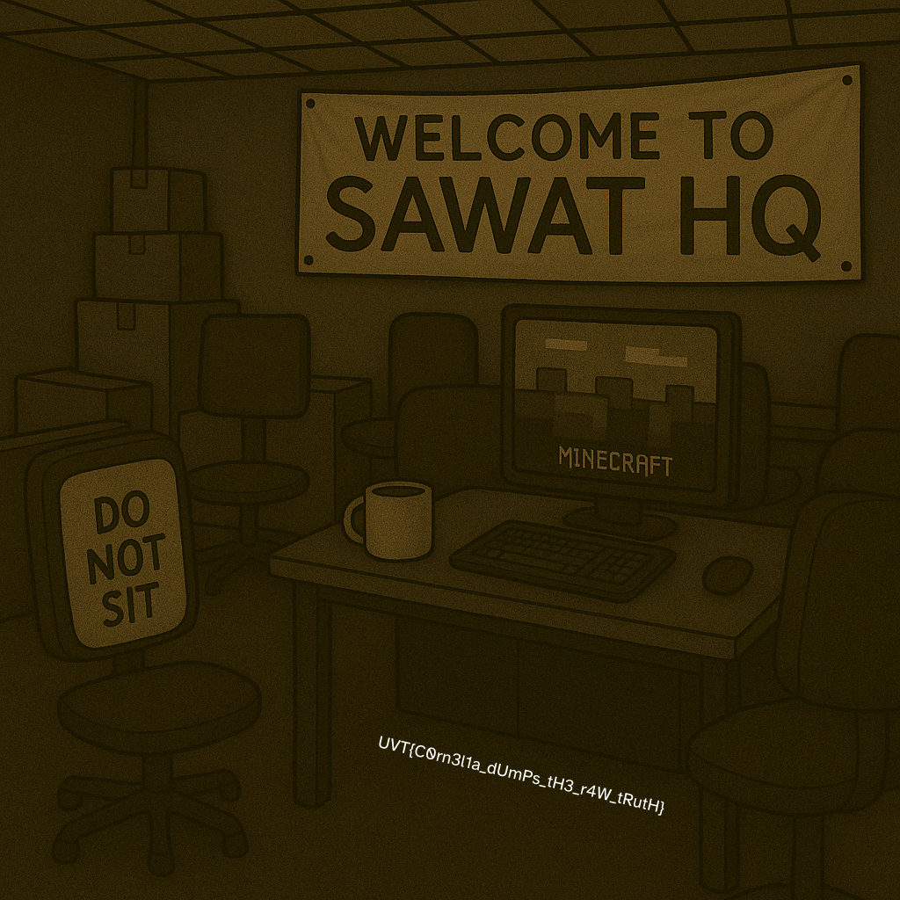

## [Cryptography]

## Shuffling


### Solution  
---
```python
import random
import time

# Original permutation
P = [15, 6, 19, 20, 28, 11, 27, 16, 0, 14, 22, 25, 4, 17, 30, 9, 1, 7, 23, 13, 31, 26, 2, 8, 18, 12, 29, 5, 21, 10, 3, 24]

# Create inverse permutation for unshuffling
def create_inverse_permutation(P):
    inverse_P = [0] * len(P)
    for i, p in enumerate(P):
        inverse_P[p] = i
    return inverse_P

def unshuffle(shuffled_list, inverse_P):
    unshuffled = [0] * len(shuffled_list)
    for i in range(len(shuffled_list)):
        unshuffled[inverse_P[i]] = shuffled_list[i]
    return unshuffled

def decrypt(ciphertext_hex):
    # Convert hex string to bytes
    ct = bytes.fromhex(ciphertext_hex)
    
    # Create inverse permutation for unshuffling
    inverse_P = create_inverse_permutation(P)
    
    # Since we know the encryption steps:
    # 1. Set random seed to sum of shuffled values
    # 2. Generate key and XOR
    
    # We need to find the sum of shuffled values to get the key
    # We'll try a range of possible sums that would be reasonable for ASCII text
    for potential_sum in range(2000, 4000):
        random.seed(potential_sum)
        key = random.randbytes(len(ct))
        
        # XOR the ciphertext with the key to get shuffled values
        shuffled = [c ^ k for c, k in zip(ct, key)]
        
        # Check if the sum of these values matches our potential sum
        if sum(shuffled) == potential_sum:
            # We found the correct sum! Now unshuffle
            unshuffled = unshuffle(shuffled, inverse_P)
            
            # Convert to a string, stopping at padding
            flag = ""
            for val in unshuffled:
                if 32 <= val <= 126:  # Printable ASCII
                    flag += chr(val)
                else:
                    # We've likely reached the padding
                    break
            
            # Check if it looks like a flag
            if "UVT{" in flag and "}" in flag:
                start = flag.find("UVT{")
                end = flag.find("}", start) + 1
                return flag[start:end]
    
    return "Decryption failed. The ciphertext might be corrupted or the algorithm might have changed."

# Decrypt the ciphertext
ciphertext = "50d553c657e8deff8e103dffa796f8c80f16e6113aa39b025d5690d0771ebf88"
print(decrypt(ciphertext))
```

### Final Result
---
  
**Flag:** `UVT{1_l1ke_t0_m0v3_1t_m0v3_i7}`


## [Forensics]

## RAMblings of Cornelia  
  

### Goals
---
Get familiar with the dumpfiles feature in memory forensics

### Solution  
---
1. Use MemprocFS or Volatility3 to perform a filescan to obtain the file address inside processes.  
` windows.filescan.Filescan`
2. Search for evidences related to "SAWAT"
  
3. Dumpfiles company-intel.7z, and kind-reminder.txt
4. Extract the 7zip compressed folder, with the password given in kind-reminder.txt  

### Final Result
---
  
**Flag:** `UVT{C0rn3l1a_dUmPs_tH3_r4W_tRutH}`


## Dark Web Stories  
  

### Goals
---
1. Capture the network packets using WireShark.
2. Understand how MD5 hashing decryption works.
3. Perform a Steganography Analysis to retrieve the flag.

### Solution  
---
1. Export all the HTTP Packets from WireShark
2. Extract MD5 hashes hidden accross the packets
```
5dbc98dcc983a70728bd082d1a47546e
f72c915d8f575a5c0999b5f37b6d99b7
a20bba554bfa1580a9d4aa2b6879ed46
02beeea47ee3cfe212e6bd843b9ce7d3
3112c7a8b6cd1677db0e3173e140fc05
50f4646135205fd4a5417e460cf71d3c
eb22cfa0890a2df3177966854a7176bc
845f49aa19c955b849d57593bf09d224
87f63931da79aa969ac4a776ce6cfb03
9793d9d6041c80f46ad7c1f530c8bbf8
2f88d89a8f50426a6285449be3286708
61bd22f017588208a0cacdf9a1a7ca1e
a7623c8b76316e10538782371b709415
c6cca42180caba17e9e6882dc66cc6ee
7c854900e46ebc5ee5680032b3e334de
ac81882b848b7673d73777ca22908c0d
4ce97d67963edca55cdd21d46a68f5bb
4abb62a00bccb775321f2720f2c7750b
67e00e8ef738fe75afdb42b22e50371e
b561052e5697ee5f1491b5e350fb78e1
```
3. Decrypt the MD5 hashes by running the script below
```python
#!/usr/bin/env python3
import hashlib
import string

def calculate_md5(text):
    """Calculate MD5 hash of given text"""
    return hashlib.md5(text.encode()).hexdigest()

def main():
    # Read the MD5 hashes from the file
    with open('md5_hashes.txt', 'r') as f:
        hashes = [line.strip() for line in f.readlines()]
    
    # Known pattern starting with "S", "Su", "Sup", "Sup3"
    current_text = ""
    
    # Set of possible characters to try
    possible_chars = string.ascii_letters + string.digits + string.punctuation + " "
    
    # For each hash in the file
    for i, target_hash in enumerate(hashes):
        found = False
        
        # Try appending each possible character and check if hash matches
        for char in possible_chars:
            test_text = current_text + char
            test_hash = calculate_md5(test_text)
            
            if test_hash == target_hash:
                current_text = test_text
                print(f"Line {i+1}: {current_text} -> {target_hash}")
                found = True
                break
        
        if not found:
            print(f"Failed to find match for hash at line {i+1}: {target_hash}")
            break
    
    print("\nFinal decrypted message:", current_text)

if __name__ == "__main__":
    main()
```
4. Obtain the password
```
Line 1: S -> 5dbc98dcc983a70728bd082d1a47546e
Line 2: Su -> f72c915d8f575a5c0999b5f37b6d99b7
Line 3: Sup -> a20bba554bfa1580a9d4aa2b6879ed46
Line 4: Sup3 -> 02beeea47ee3cfe212e6bd843b9ce7d3
Line 5: Sup3r -> 3112c7a8b6cd1677db0e3173e140fc05
Line 6: Sup3r$ -> 50f4646135205fd4a5417e460cf71d3c
Line 7: Sup3r$3 -> eb22cfa0890a2df3177966854a7176bc
Line 8: Sup3r$3c -> 845f49aa19c955b849d57593bf09d224
Line 9: Sup3r$3cr -> 87f63931da79aa969ac4a776ce6cfb03
Line 10: Sup3r$3cre -> 9793d9d6041c80f46ad7c1f530c8bbf8
Line 11: Sup3r$3cre7 -> 2f88d89a8f50426a6285449be3286708
Line 12: Sup3r$3cre7P -> 61bd22f017588208a0cacdf9a1a7ca1e
Line 13: Sup3r$3cre7P4 -> a7623c8b76316e10538782371b709415
Line 14: Sup3r$3cre7P4$ -> c6cca42180caba17e9e6882dc66cc6ee
Line 15: Sup3r$3cre7P4$S -> 7c854900e46ebc5ee5680032b3e334de
Line 16: Sup3r$3cre7P4$Sw -> ac81882b848b7673d73777ca22908c0d
Line 17: Sup3r$3cre7P4$Sw0 -> 4ce97d67963edca55cdd21d46a68f5bb
Line 18: Sup3r$3cre7P4$Sw0r -> 4abb62a00bccb775321f2720f2c7750b
Line 19: Sup3r$3cre7P4$Sw0rd -> 67e00e8ef738fe75afdb42b22e50371e
Line 20: Sup3r$3cre7P4$Sw0rd! -> b561052e5697ee5f1491b5e350fb78e1

Final decrypted message: Sup3r$3cre7P4$Sw0rd!
```

5. Unzip the `secretdata.zip` with the password obtained
6. Obtain `hacker.png`

7. Perform steganalysis on the image

### Final Result
---
ZSteg yields the flag  

**Flag:** `UVT{4_l0T_0f_lay3r5_70_unc0v3r_1nn1t?}`

## [Miscellaneous]

## Insert Coin to Play - Part 2  


### Goals
---
1. Explore how the game scoring system works
2. Use Cheat Engine to edit the scoring mechanism

### Solution  
---
1. Using dnSpy, we analyse the decompiled C# code, diving into the AddScore() function
 
2. From the logic, we find out that we need to use Cheat Engine to increment 27 manually to the original score in order to call the win function.
3. Track the corresponding scoring value with Cheat Engine and edit it.
  

### Final Result
---
  
**Flag:** `UVT{Wh4t?!_D1d_Y0u_r3aLly_c4TcH_1t?}`